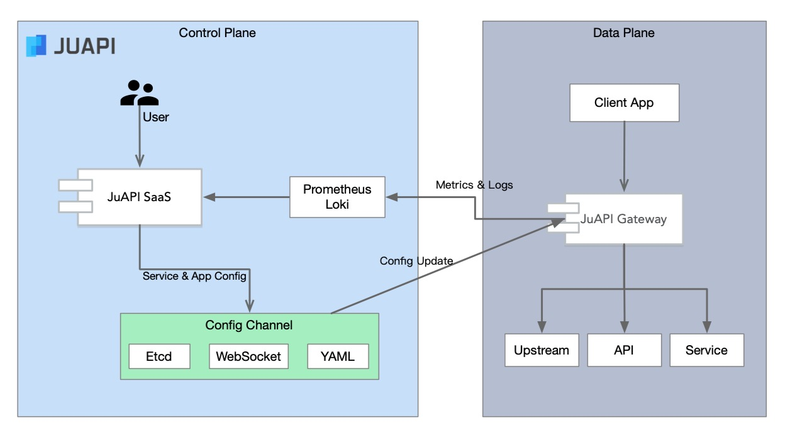

JuAPI服务运行时管理平台
=====================

## API生命周期管理

API生命周期涉及API的设计，开发，运行三个领域：

API设计阶段的目标是完成API的定义，设计阶段需要的工具包括：API定义标准（OAS，RAML，Swagger），API协作开发（Mulesoft API Designer，
Stoplight，YAPI），文档展示（ReDoc，SwaggerUI）

API开发阶段的目标是辅助API的提供方和使用方完成API服务的服务器端和客户端实现，支持API开发的工具包括：代码生成（Swagger CodeGen），Mocking
（Prism），自动测试。

API运行阶段的目标是保证API的安全稳定的运行，需要一些公共的基础设施的支持，包括：运行数据监控，日志服务，TLS连接加密，认证，限流，负载均衡等。

JuAPI定位于服务API运行阶段的需求，提供开源的hyperapi网关实现服务的路由，负载均衡，认证，限流，加密等功能；网关支持集成Prometheus和ELK实现数据
监控和日志收集，检索，报警等功能；JuAPI的SaaS服务可以实时的管理网关上部署的服务和应用，提供一个去中心化的API服务运行时管理平台。

JuAPI使用OAS作为定义API的标准格式，通过API定义文件与支持OAS的API设计开发工具集成。

## 开源API网关对比

* Mulesoft
* Tyk
* Kong
* Goku
* APISIX

## 产品目标

* 为软件服务的API化改造提供基础设施（路由，负载均衡，认证，限流，监控）；
* 提供一个简单易用，高性能，高扩展性的开源API网关（可替代nginx）；
* 实现一个企业内部的API服务协作平台，帮助技术团队自由便捷的发布和使用API服务，促进技术能力的输出和复用；
* 对接Prometheus提供API服务的性能监控
* 对接ELK实现API服务的日志收集和分析

### 非目标

* SaaS化ESB，接口集中化管理
* API计量计费
* API编排，组合，内容转换

